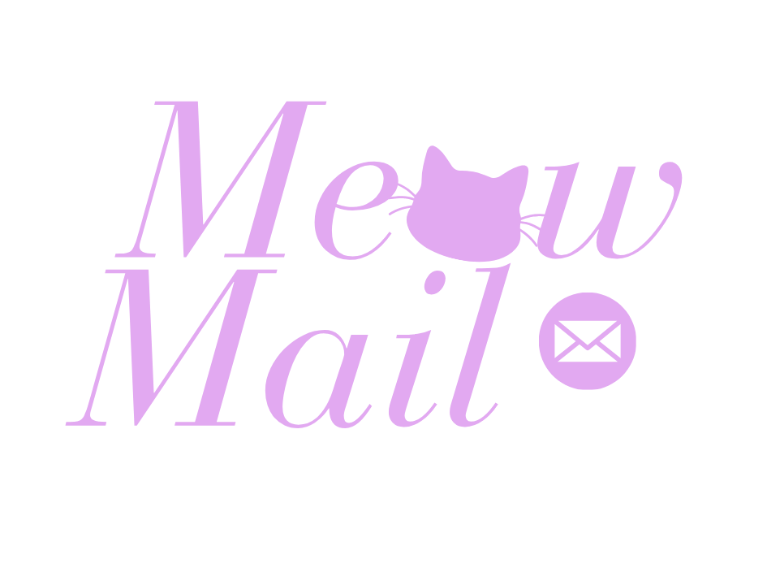

<p align="center">
  
</p>

<h1 align="center">🐱 MeowMail</h1>
<p align="center">
  <strong>Template engine & mail merge untuk Google Apps Script</strong>
  <br>
  Kirim email personalisasi massal dengan template {{ variabel }}, kondisional #if, looping #each, dan filter bawaan.
</p>

<p align="center">
  <a href="#-fitur">Fitur</a> •
  <a href="#-cara-pakai">Cara Pakai</a> •
  <a href="#-sintaks-template">Sintaks</a> •
  <a href="#-filter">Filter</a> •
  <a href="#-konfigurasi">Konfigurasi</a>
</p>

---

> **Butuh versi stabil?** Gunakan [mail-merge-script](https://github.com/muhfajarags/mail-merge-script) — implementasi sederhana tanpa template engine.

## 📦 Fitur

- **Template engine** — variabel `{{ nama }}`, raw `{{{ html }}}`
- **Kondisional** — `{{#if field}} ... {{/if}}`
- **Looping** — `{{#each items}} ... {{/each}}` dengan `@index`, `@first`, `@last`
- **Filter pipeline** — `{{ harga | currency }}`, `{{ tanggal | date }}`, dll
- **HTML escape** otomatis (kecuali raw placeholder)
- **Batch send** dari Google Sheet — dengan delay, quota buffer, retry
- **Custom filter** — daftarkan filter sendiri
- **Preview** — lihat hasil render sebelum kirim

## ⚡ Cara Pakai

```js
// Buat template
var mail = MeowMail.create(`
  <h1>Halo, {{ nama | capitalize }}!</h1>
  <p>Tagihan {{ bulan }}: <b>Rp {{ tagihan | currency }}</b></p>
`).subject('Tagihan {{ bulan }} untuk {{ nama }}');

// Kirim satu email
mail.send({ to: 'user@email.com', nama: 'Budi', bulan: 'Juni', tagihan: 150000 });

// Batch dari Sheet
mail.sendBatch({
  source: SpreadsheetApp.getActiveSheet(),
  toColumn: 'email',
  delay: 300
});
```

## 🧩 Sintaks Template

| Sintaks | Deskripsi |
|---------|-----------|
| `{{ variabel }}` | Placeholder (HTML di-escape) |
| `{{{ variabel }}}` | Raw placeholder (HTML tetap) |
| `{{ variabel | filter }}` | Pipeline filter |
| `{{#if field}}...{{/if}}` | Kondisional |
| `{{#each arr}}...{{/each}}` | Looping array |
| `{{@index}}` | Index loop (0-based) |
| `{{@first}}` | Boolean, true jika item pertama |
| `{{@last}}` | Boolean, true jika item terakhir |

## 🔧 Filter Bawaan

| Filter | Contoh | Hasil |
|--------|--------|-------|
| `date` | `{{ tgl \| date:'yyyy-MM-dd' }}` | Format tanggal |
| `currency` | `{{ 50000 \| currency }}` | `Rp 50.000` |
| `upper` | `{{ nama \| upper }}` | `BUDI` |
| `lower` | `{{ nama \| lower }}` | `budi` |
| `capitalize` | `{{ nama \| capitalize }}` | `Budi` |
| `truncate` | `{{ text \| truncate:20 }}` | Potong teks |
| `default` | `{{ kosong \| default:'N/A' }}` | Fallback |
| `nl2br` | `{{ text \| nl2br }}` | `\n` jadi `<br>` |

## ⚙️ Konfigurasi

```js
MeowMail.configure({
  defaultFrom: 'noreply@example.com',
  defaultDelay: 300,
  maxPerRun: 50,
  quotaBuffer: 20,
  locale: 'id-ID'
});
```

## 🧪 Testing

Jalankan test dari editor Apps Script atau CLI:

```js
function testMeowMail() {
  // Test template
  var result = MeowMail.create('Halo {{ nama }}')
    .preview({ nama: 'Dunia' });

  Logger.log(result.html); // "Halo Dunia"
}
```

## 📄 Lisensi

MIT
